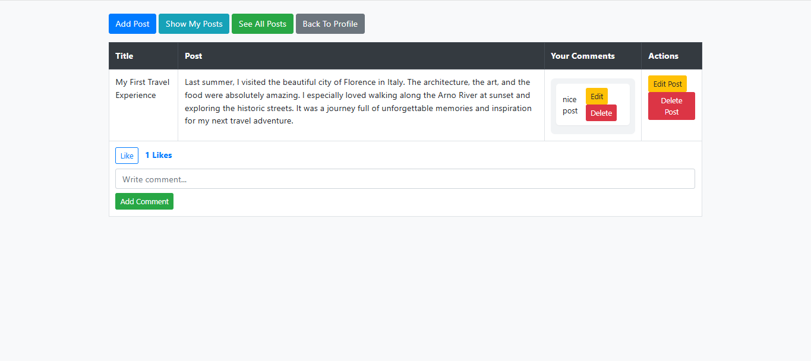

  

# 📰 Simple Blog System (PHP Native & OOP)

A simple blogging system built using **PHP NAtive with Object-Oriented Programming (OOP)** and **MySQL** — without any frameworks.  
This project was created to practice PHP fundamentals, OOP structure, CRUD operations, and authentication using sessions.

---

## 🚀 Features
- 🧑‍💻 **User Authentication** (Register, Login, Logout)
- 📝 **Create / Edit / Delete Posts**
- 💬 **Add / Edit / Delete Comments**
- ❤️ **Like / Unlike Posts**
- 👁️‍🗨️ **View All Posts and Comments**
- 🧱 Structured using **OOP Classes** for `User`, `Post`, `Comment`, and `Like`
- 🔒 Middleware system (`auth.php`, `guest.php`) for page access control
- 🎨 Clean Bootstrap-based responsive design

---

## 🧠 What I Learned
- Applying **OOP concepts** in real PHP projects  
- Handling **CRUD operations** with MySQL  
- Implementing **authentication** using sessions  
- Building reusable **Model classes**  
- Separating logic and UI for maintainability  
- Using **Bootstrap** to design a responsive interface  

---

## 🛠️ Technologies Used
- **PHP (Native OOP PHP)**
- **MySQL**
- **HTML5**
- **CSS3**
- **Bootstrap 4**

---

## ⚙️ How to Run Locally

### 1️⃣ Move the project folder to your local server directory  
Example paths:  
C:\laragon\www
C:\xampp\htdocs

### 2️⃣ Start your local server  
(e.g. **Laragon** or **XAMPP**)

### 3️⃣ Import the database  
- Open **phpMyAdmin**  
- Create a new database (e.g. `simple_blog_system`)  
- Import the `.sql` file from the project folder

### 4️⃣ Open the project in your browser  
 http://localhost/Simple%20Blog%20System/

---

## 💡 Future Improvements
- 🧩 Add image uploads for posts  
- 🔐 Add email verification system  
- 🕵️‍♂️ Add admin panel for managing users and posts  
- 🌙 Add dark mode UI  
- 📱 Improve mobile responsiveness  

---

## 🧑‍💻 Author
 **Mohamed Ashraf**  
  📧 Email: mohamed_ashraf4444@hotmail.com  
  🌐 GitHub: [https://github.com/salah3122001](https://github.com/salah3122001)  
  🔗 LinkedIn: [https://www.linkedin.com/in/mohamed-ashraf-14916a367](https://www.linkedin.com/in/mohamed-ashraf-14916a367)
       

---

